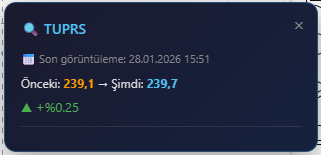
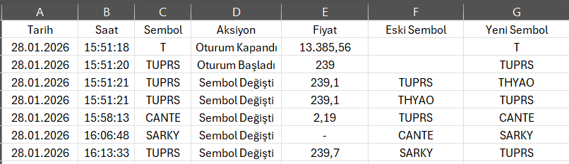

# 📊 TradingView Hisse Takip Uzantısı

TradingView'de hisse değişimlerinizi otomatik olarak loglayan, fiyat geçmişini takip eden ve kişisel notlarınızı saklayan Chrome uzantısı.

---

## ✨ Özellikler

### 🔄 Otomatik Hisse Loglama
- Hisse değiştirdiğinizde otomatik olarak kayıt oluşturur
- Tarih, saat ve anlık fiyat bilgisini saklar
- Oturum başlangıç/bitiş kayıtları

<!-- EKRAN GÖRÜNTÜSÜ: Popup loglar sekmesi - hisse değişim kayıtları listesi -->


---

### 📝 Hisse Notları
- Her hisse için kişisel not ekleyebilme
- Destek/direnç seviyeleri, analizler, hatırlatmalar
- Hisseye girdiğinizde notunuzu toast bildirimi ile görme

<!-- EKRAN GÖRÜNTÜSÜ: Popup notlar sekmesi - not yazma alanı ve kayıtlı notlar -->


---

### 🔔 Son Görüntüleme Uyarısı
Bir hisseye tekrar girdiğinizde:
- En son ne zaman baktığınızı gösterir
- O zamanki fiyat ile şu anki fiyatı karşılaştırır
- Yüzdesel değişimi hesaplar (▲ Yükseldi / ▼ Düştü / ➡️ Değişmedi)

<!-- EKRAN GÖRÜNTÜSÜ: Sayfa içi toast bildirimi - fiyat karşılaştırması -->


---

### 📥 Veri Dışa Aktarma
- Tüm logları CSV formatında indirme
- Excel uyumlu format (Türkçe karakter desteği)
- Tarih, saat, sembol, fiyat, değişim bilgileri

<!-- EKRAN GÖRÜNTÜSÜ: İndirilen CSV dosyasının Excel'de görünümü -->


---

## 🚀 Kurulum

### Chrome Web Store'dan (Yakında)
1. Chrome Web Store'a gidin
2. "TradingView Hisse Takip" arayın
3. "Chrome'a Ekle" butonuna tıklayın

### Manuel Kurulum (Geliştirici Modu)
1. Bu repository'yi indirin veya klonlayın
2. Chrome'da `chrome://extensions` adresine gidin
3. Sağ üstten **"Geliştirici modu"** nu açın
4. **"Paketlenmemiş yükle"** butonuna tıklayın
5. İndirdiğiniz klasörü seçin

---

## 📖 Kullanım

### Temel Kullanım
1. TradingView'de herhangi bir hisse grafiği açın
2. Hisse değiştirdikçe uzantı otomatik olarak loglar
3. Uzantı ikonuna tıklayarak logları görüntüleyin

### Not Ekleme
1. Uzantı popup'ında **"Notlar"** sekmesine gidin
2. Aktif hisse için notunuzu yazın
3. **"Notu Kaydet"** butonuna tıklayın
4. Aynı hisseye tekrar girdiğinizde notunuz bildirim olarak çıkacak

### CSV Dışa Aktarma
1. **"Loglar"** sekmesinde **"CSV İndir"** butonuna tıklayın
2. Dosya otomatik olarak indirilecek
3. Excel veya Google Sheets ile açabilirsiniz

---

## 📁 Dosya Yapısı

```
TradingView_Log_Takibi/
├── manifest.json      # Uzantı yapılandırması
├── content.js         # TradingView sayfasında çalışan script
├── background.js      # Arka plan service worker
├── popup.html         # Popup arayüzü
├── popup.js           # Popup işlevleri
├── popup.css          # Popup stilleri
├── icon16.png         # Küçük ikon
├── icon48.png         # Orta ikon
├── icon128.png        # Büyük ikon
└── README.md          # Bu dosya
```

---

## 🛠️ Teknolojiler

- **Manifest V3** - Modern Chrome Extension API
- **Chrome Storage API** - Veri saklama
- **MutationObserver** - DOM değişiklik takibi
- **Vanilla JavaScript** - Framework bağımsız

---

## 🔒 Gizlilik

- Tüm veriler **yerel olarak** cihazınızda saklanır
- Hiçbir veri harici sunuculara gönderilmez
- Sadece TradingView sitesinde çalışır
- Kişisel bilgi toplanmaz

---

## 🤝 Katkıda Bulunma

1. Bu repository'yi fork edin
2. Yeni bir branch oluşturun (`git checkout -b feature/yeni-ozellik`)
3. Değişikliklerinizi commit edin (`git commit -m 'Yeni özellik eklendi'`)
4. Branch'inizi push edin (`git push origin feature/yeni-ozellik`)
5. Pull Request açın

---

## 📧 İletişim

Sorularınız veya önerileriniz için issue açabilirsiniz.

---

<p align="center">
  <strong>⭐ Beğendiyseniz yıldız vermeyi unutmayın!</strong>
</p>
