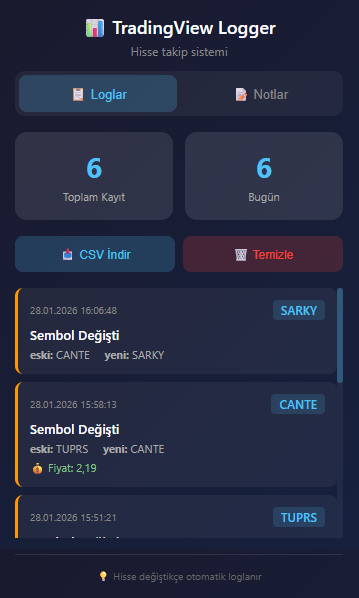
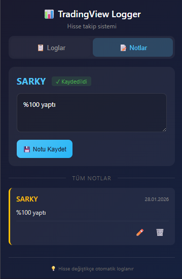

# 📊 TradingView Hisse Takip Uzantısı

TradingView'de hisse değişimlerinizi otomatik olarak loglayan, fiyat geçmişini takip eden ve kişisel notlarınızı saklayan Chrome uzantısı.

**Version 2.0.0** - Production Ready

---

## ✨ Özellikler

### 🔄 Otomatik Hisse Loglama
- Hisse değiştirdiğinizde otomatik olarak kayıt oluşturur
- Tarih, saat ve anlık fiyat bilgisini saklar
- Oturum başlangıç/bitiş kayıtları
- **Ring buffer pattern** ile stabil sembol tespiti

<!-- EKRAN GÖRÜNTÜSÜ: Popup loglar sekmesi -->


---

### 📈 Fiyat Karşılaştırma
Bir hisseye tekrar girdiğinizde:
- En son ne zaman baktığınızı gösterir
- O zamanki fiyat ile şu anki fiyatı karşılaştırır
- Yüzdesel değişimi hesaplar (▲ Yükseldi / ▼ Düştü / ➡️ Değişmedi)

<!-- EKRAN GÖRÜNTÜSÜ: Fiyat karşılaştırma toast -->


---

### 📝 Hisse Notları
- Her hisse için kişisel not ekleyebilme
- Destek/direnç seviyeleri, analizler, hatırlatmalar
- Hisseye girdiğinizde notunuzu toast bildirimi ile görme

<!-- EKRAN GÖRÜNTÜSÜ: Notlar sekmesi -->


---

### 📥 Veri Dışa Aktarma
- RFC 4180 uyumlu CSV export
- Excel/LibreOffice/Google Sheets uyumlu
- UTF-8 + BOM ile Türkçe karakter desteği

---

## 🚀 Kurulum

### Manuel Kurulum (Geliştirici Modu)
1. Bu repository'yi indirin veya klonlayın
2. Chrome'da `chrome://extensions` adresine gidin
3. Sağ üstten **"Geliştirici modu"** nu açın
4. **"Paketlenmemiş yükle"** butonuna tıklayın
5. `TradingView_Logger` klasörünü seçin

---

## 📁 Dosya Yapısı

```
TradingView_Logger/
├── manifest.json      # Uzantı yapılandırması (v3)
├── content.js         # Core classes + orchestration
├── background.js      # Message handling + storage
├── popup.html         # Popup arayüzü
├── popup.js           # Popup logic
├── popup.css          # Modern dark theme
├── icon16.png         # Küçük ikon
├── icon48.png         # Orta ikon
└── icon128.png        # Büyük ikon
```

---

## 🏗️ Mimari

### Core Classes (content.js)

| Class | Açıklama |
|-------|----------|
| `ErrorHandler` | Merkezi hata yönetimi ve loglama |
| `PriceFormatter` | Fiyat normalizasyonu ve karşılaştırma |
| `ExtensionLifecycle` | Kaynak yönetimi ve cleanup |
| `NotificationManager` | Toast kuyruk sistemi |
| `SymbolDetector` | Ring buffer ile stabil tespit |
| `SymbolMonitor` | MutationObserver yönetimi |
| `StateManager` | Component senkronizasyonu |
| `TradingViewLogger` | Ana orkestratör |

### Background (background.js)

| Class | Açıklama |
|-------|----------|
| `StorageManager` | Atomic storage işlemleri |
| `LogHandler` | Log CRUD operasyonları |

---

## 🔒 Gizlilik

- Tüm veriler **yerel olarak** cihazınızda saklanır
- Hiçbir veri harici sunuculara gönderilmez
- Sadece TradingView sitesinde çalışır
- Minimal izinler (storage, activeTab, tabs)

---

## 📝 Changelog

### v2.0.0
- 🏗️ Complete architecture refactoring
- 🐛 Race condition fixes with ring buffer pattern
- 📊 Improved price detection and formatting
- 🔔 New notification system with queue
- 💾 Atomic storage operations
- 📤 RFC 4180 compliant CSV export
- 🧹 Memory leak prevention with lifecycle management

### v1.0.0
- Initial release

---

## 📧 İletişim

Sorularınız veya önerileriniz için issue açabilirsiniz.

---

<p align="center">
  <strong>⭐ Beğendiyseniz yıldız vermeyi unutmayın!</strong>
</p>
