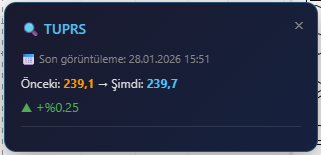
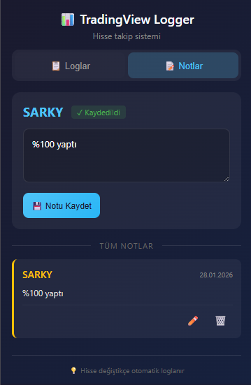
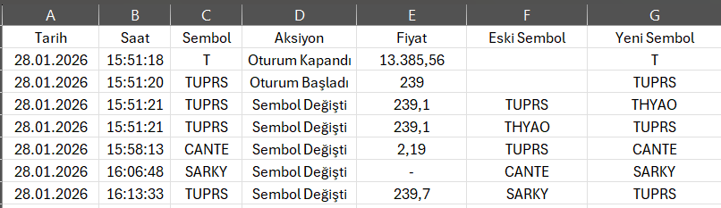

# 📊 TradingView Logger

TradingView'de hisse değişimlerinizi otomatik olarak loglayan, inceleme sürelerini takip eden, fiyat geçmişini karşılaştıran, çoklu kişisel yorumlar, etiketler, tekrar bak hatırlatmaları ve isteğe bağlı Telegram bildirimleri sunan Chrome uzantısı.

**Version 3.1.0**

---

## ✨ Özellikler

### 🔄 Otomatik Hisse Loglama
- Hisse değiştirdiğinizde otomatik kayıt oluşturur
- Tarih, saat ve anlık fiyat bilgisini saklar
- Oturum başlangıç / bitiş kayıtları
- MutationObserver + periyodik kontrol ile stabil sembol tespiti (debounce: 1.5 sn)
- Sembol tespiti için 4 kaynak: Chart Legend → Header toolbar → Sayfa başlığı → URL parametresi

---

### 📈 Fiyat Karşılaştırma (Toast Bildirimi)
Bir hisseye girdiğinizde sağ üstte toast bildirimi gösterilir:
- Etiketler (renk kodlu)
- Son görüntüleme tarihi ve o günkü fiyat
- Önceki fiyat → Şimdiki fiyat, yüzdesel değişim (▲ Yükseldi / ▼ Düştü / ➡ Değişmedi)
- Toplam inceleme süresi ve seans sayısı
- Not önizlemesi (ilk 90 karakter)



---

### ⏱️ İnceleme Süresi Takibi
- Her sembolde geçirilen süre otomatik ölçülür
- 2 saniyeden kısa geçişler görmezden gelinir
- `chrome.storage.local['stockTimeLog']` içinde saklanır
- İstatistik sekmesinde seans sayısı ve toplam süreyle birlikte gösterilir

---

### 🏷️ Etiketleme Sistemi
Her hisse için önceden tanımlı etiketler atayabilirsiniz:

| Etiket | Renk |
|--------|------|
| 👀 İzleme Listesi | Mavi |
| 🟢 Al Listesi | Yeşil |
| 🔴 Sat Listesi | Kırmızı |
| ✅ İncelendi | Mor |
| ⚠️ Dikkatli | Sarı |
| ⭐ Favori | Turuncu |

---

### 📝 Hisse Yorumları ve Hatırlatmalar
- Her hisse için birden fazla yorum ekleyebilme
- Yorum eklenirken o anki fiyat snapshot'ı saklanır
- Yorum kartında `Yorum fiyatı`, `Şimdi` ve performans yüzdesi gösterilir
- Eski yorumlarda fiyat bilgisi yoksa `Fiyat kaydı yok` bilgisi görünür
- Yorum bazlı etiketler: `Alım fikri`, `Risk`, `Teknik`, `Haber`, `Takip`
- Tekrar bak hatırlatması: `Bugün`, `Yarın`, `3 gün`
- "Bugün kontrol edilecekler" panelinden kontrol edilen yorumlar tek tıkla tamamlanır
- Hisse detay panelinde yorumlar, etiketler, toplam süre, seans sayısı, son fiyat ve son loglar birlikte görüntülenir
- Etiket bazlı ve metin tabanlı arama
- Yorumlar CSV veya JSON olarak dışa aktarılabilir



---

### 📊 İstatistik Sekmesi
- Bugün kaç log, kaç farklı hisse, toplam süre
- En çok görüntülenen 10 hisse (bar chart, altın/gümüş/bronz sıralama)
- En uzun incelenen 8 hisse (süre bar chart, fiyat değişimi)
- Son 30 günün OPFS arşivi + bugünkü buffer birleştirilerek hesaplanır

---

### 🗄️ Arşiv (OPFS Depolama)
- Günlük loglar **Origin Private File System (OPFS)** üzerinde `.jsonl` formatında arşivlenir
- Her gün ayrı dosya: `logs/2025-04-18.jsonl`
- Arşiv indeksi: `logs_index.json` (en yeni gün öne)
- Arşiv sekmesinden gün seçerek detay görüntülenebilir
- Günlük OPFS depolama bilgisi (kullanılan alan, arşivlenen gün sayısı) gösterilir

**Hibrit Depolama:**
- `chrome.storage.local[activityLogs_today]` → Bugünkü loglar (max 500 kayıt)
- OPFS → Geçmiş günler (sınırsız, tarayıcı korumalı alanı)

---

### 📥 Dışa Aktarma
- Bugünkü loglar veya seçili arşiv günü CSV olarak indirilebilir
- "Tümünü İndir" ile tüm OPFS arşivi tek CSV'ye aktarılır
- **UTF-16 LE + BOM** encoding — Excel'in tüm versiyonlarında Türkçe karakterler bozulmaz
- Log CSV delimiter'ı: `;` (Türkçe Excel varsayılanı)
- Not CSV çıktısı Excel uyumu için **UTF-16 LE + BOM** ve sekme ayracıyla üretilir
- Not JSON çıktısı ham veri inceleme ve yedekleme için kullanılabilir
- Meta blok (rapor adı, tarih aralığı, hisse sayısı) + veri satırları + hisse bazında özet



---

### 📬 Telegram Bildirimleri (İsteğe Bağlı)
Bot token uzantıda **hiç tutulmaz**; bir Cloudflare Worker proxy üzerinden iletilir.

Gönderilen bildirimler:
- **Günlük arşiv özeti** — gün arşivlendiğinde otomatik (en çok bakılan 5 hisse, toplam süre)
- **Not güncellemesi** — not kaydedilince
- **Bugünün özeti** — "Bugunun Ozetini Gonder" butonuyla manuel

Kurulum için `telegram-proxy/` klasörüne bakın.

---

### 🪟 Pinned (Büyük Pencere) Modu
Popup'taki ⧉ butonu uzantıyı 680×900 boyutunda ayrı bir popup penceresinde açar.

---

## 🚀 Kurulum

### Manuel Kurulum (Geliştirici Modu)
1. Bu repository'yi indirin veya klonlayın
2. Chrome'da `chrome://extensions` adresine gidin
3. Sağ üstten **"Geliştirici modu"**nu açın
4. **"Paketlenmemiş yükle"** butonuna tıklayın
5. `tvlogger-v3.1` klasörünü seçin

---

## 📁 Dosya Yapısı

```
tvlogger-v3.1/
├── manifest.json              # Uzantı yapılandırması (Manifest v3)
├── assets/
│   ├── icon16.png
│   ├── icon32.png
│   ├── icon48.png
│   └── icon128.png
└── src/
    ├── shared/
    │   ├── constants.js       # Storage anahtarları, OPFS yolları, aksiyonlar, etiketler
    │   ├── strings.js         # Popup'ta kullanılan merkezi küçük UI metinleri
    │   ├── utils.js           # Fiyat normalizasyonu, süre formatı, HTML escape
    │   └── storage.js         # StorageManager — OPFS okuma/yazma/arşiv/migrasyon
    ├── content/
    │   ├── detector.js        # detectSymbol(), extractCurrentPrice()
    │   ├── timer.js           # Timer — sembol başına inceleme süresi
    │   ├── toast.js           # showToast() — sağ üst bildirim
    │   └── content.js         # Ana orkestratör, sembol değişim akışı
    ├── background/
    │   └── background.js      # Log kayıt, arşivleme, Telegram, pinned window
    └── popup/
        ├── popup.html         # Arayüz (5 sekme)
        ├── popup.css          # Dark theme
        ├── popup.js           # Tab yönetimi, live durum
        ├── logs.js            # Loglar sekmesi (arama, filtre, sıralama)
        ├── notes.js           # Notlar sekmesi (etiket editörü dahil)
        ├── stats.js           # İstatistik sekmesi
        ├── archive.js         # Arşiv sekmesi (OPFS)
        ├── csv-exporter.js    # CSV dışa aktarma (UTF-16 LE)
        └── telegram.js        # Telegram ayarları ve gönderim

telegram-proxy/
├── cloudflare-worker.js       # Cloudflare Worker — Telegram proxy
├── wrangler.toml.example      # Wrangler yapılandırma şablonu
└── .dev.vars.example          # Yerel geliştirme ortam değişkenleri
```

---

## 🏗️ Mimari

### Content Scripts (yükleme sırası)

| Modül | Görev |
|-------|-------|
| `constants.js` | Global sabitler — tüm modüller bu dosyaya bağımlı |
| `strings.js` | Popup içinde kullanılan merkezi UI metinleri |
| `utils.js` | Paylaşılan yardımcı fonksiyonlar |
| `detector.js` | DOM'dan sembol ve fiyat okuma |
| `timer.js` | `Timer` modülü — sembol bazında oturum süresi |
| `toast.js` | `showToast()` — sayfaya animasyonlu bildirim enjekte eder |
| `content.js` | Orkestratör — MutationObserver, debounce, log gönderme |

### Background Service Worker

| Sorumluluk | Açıklama |
|-----------|----------|
| Log kayıt | Gelen `LOG_ACTIVITY` mesajını today buffer'a yazar |
| Otomatik arşiv | Yeni gün başında dünkü logları OPFS'e taşır |
| Telegram | Arşiv özeti, not bildirimi, bugün özeti mesajları |
| Pinned window | Tekil popup penceresi açma |
| Migration | Eski `activityLogs` formatını OPFS'e geçirir |

### Popup (5 Sekme)

| Sekme | Modül | İçerik |
|-------|-------|--------|
| Loglar | `logs.js` | Arama, aksiyon filtresi, sıralama, CSV indir |
| Notlar | `notes.js` | Çoklu yorumlar, yorum performansı, etiketler, hatırlatmalar, detay paneli, not export |
| İstatistik | `stats.js` | Görüntülenme ve süre sıralaması, bugün özeti |
| Arşiv | `archive.js` | Gün listesi + detay, toplu CSV, OPFS bilgisi |
| Telegram | `telegram.js` | Endpoint URL, Chat ID, Client secret ayarları |

---

## 🔒 Gizlilik

- Tüm veriler **yerel olarak** tarayıcınızda saklanır (chrome.storage.local + OPFS)
- Telegram entegrasyonu **isteğe bağlıdır** ve devre dışıyken hiçbir dış bağlantı yapılmaz
- Telegram etkinleştirilirse loglar yalnızca sizin kontrolünüzdeki proxy endpoint'e gönderilir
- Bot token uzantı içinde tutulmaz — sadece Cloudflare Worker ortam değişkeninde saklanır
- Sadece TradingView sitesinde çalışır
- İzinler: `storage`, `tabs`, `windows`

---

## 📝 Changelog

### v3.1.0
- 📝 Hisse başına çoklu yorum desteği
- 📈 Yorum fiyat snapshot'ı ve güncel fiyata göre performans yüzdesi
- 🧭 Hisse detay paneli
- 🏷️ Yorum bazlı etiketler
- 🔔 Tekrar bak hatırlatmaları ve kontrol edildi akışı
- 📤 Notları CSV/JSON olarak dışa aktarma
- 👁️ Popup yardımcı metinlerinde daha okunabilir kontrast
- 🧩 Popup için merkezi küçük UI string dosyası
- 🗄️ OPFS (Origin Private File System) ile sınırsız günlük arşiv
- 📬 Cloudflare Worker üzerinden Telegram bildirimleri
- ⏱️ Sembol başına inceleme süresi takibi (Timer modülü)
- 🏷️ 6 önceden tanımlı etiket sistemi
- 📊 İstatistik sekmesi (görüntülenme & süre sıralaması)
- 🗄️ Arşiv sekmesi (OPFS gün listesi, detay, toplu export)
- 🪟 Pinned (büyük pencere) modu
- 📁 Modüler dosya yapısı (shared/content/background/popup)
- 🔄 Eski `activityLogs` formatından OPFS'e otomatik migrasyon
- 📥 UTF-16 LE CSV export (Excel Türkçe karakter desteği)

### v2.0.0
- Mimari yeniden yapılandırma
- Ring buffer ile sembol tespiti stabilizasyonu
- Atomik storage işlemleri
- RFC 4180 uyumlu CSV export

### v1.0.0
- İlk sürüm

---

## 📧 İletişim

Sorularınız veya önerileriniz için issue açabilirsiniz.

---

<p align="center">
  <strong>⭐ Beğendiyseniz yıldız vermeyi unutmayın!</strong>
</p>
